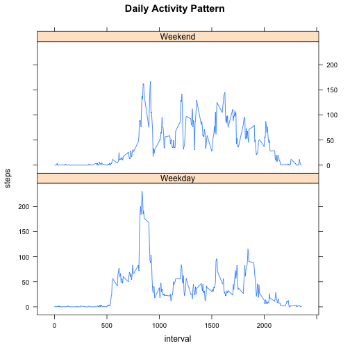

###Background
This file documents R code and its associated results for analyzing personal movement data gathered with an activity monitoring device.  This analysis was completed as the 1st required assignment for the Reproducible Research course held in November-December 2014 via the Coursera platform.

###Loading and Preprocessing the Data
A repository containing the dataset was cloned from [Github](https://github.com/rdpeng/RepData_PeerAssessment1).  Once copied into the working directory for the R session, the dataset file ("activity.csv") is read in as a data.frame under the name "Data". The datast has three variables:

- **steps**: number of steps taking in a 5-minute interval 
- **date**: date on which the measurement was taken
- **interval**: 5-minute time interval in which measurement was taken

The "date"" variable needs to be converted from a factor to a date variable.

```r
Data<-read.csv("activity.csv")
Data$date<-as.Date(Data$date)
summary(Data)
```

```
##      steps            date               interval   
##  Min.   :  0.0   Min.   :2012-10-01   Min.   :   0  
##  1st Qu.:  0.0   1st Qu.:2012-10-16   1st Qu.: 589  
##  Median :  0.0   Median :2012-10-31   Median :1178  
##  Mean   : 37.4   Mean   :2012-10-31   Mean   :1178  
##  3rd Qu.: 12.0   3rd Qu.:2012-11-15   3rd Qu.:1766  
##  Max.   :806.0   Max.   :2012-11-30   Max.   :2355  
##  NA's   :2304
```

###Mean/Median Number of Steps
After totaling the number of steps recorded each day, the average and median number of steps per day are calculated.


```r
DailySteps<-aggregate(steps~date,data=Data, FUN=sum)
hist(DailySteps$steps, main="Distribution of Daily Step Totals",
     xlab="Number of Steps")
```

 

```r
mean(DailySteps$steps)
```

```
## [1] 10766
```

```r
median(DailySteps$steps)
```

```
## [1] 10765
```

###Daily Activity Pattern
After averaging the number of steps recorded in each 5-minute time interval, the time interval with the highest average number of steps is identified.


```r
HourlySteps<-aggregate(steps~interval,data=Data, FUN=mean)
plot(steps~interval,type="l",data=HourlySteps,
      main="Daily Activity Pattern",
      ylab="Steps",xlab="Time Interval")
```

 

```r
HourlySteps[which.max(HourlySteps$steps),]
```

```
##     interval steps
## 104      835 206.2
```

###Imputting Values for NAs
The number of NAs in the dataset (and the proportion of observations they represent) is assessed.


```r
sum(is.na(Data$steps))
```

```
## [1] 2304
```

```r
sum(is.na(Data$steps))/length(Data$steps)
```

```
## [1] 0.1311
```

The magnitude of NAs in the dataset (approximately 13 percent of the observations) is substantial.  An approach for imputting missing values could provide for a more accurate analysis.  To illustrate, a new dataset is created by replacing NAs with the average number of steps for that interval on days that data were recorded.


```r
Data.adj<-merge(Data,HourlySteps,by="interval")
Data.adj$steps<-ifelse(is.na(Data.adj$steps.x),Data.adj$steps.y,Data.adj$steps.x)
require(plyr)
```

```
## Loading required package: plyr
```

```r
Data.adj<-Data.adj[,c(-2,-4)]
Data.adj<-Data.adj[,c("date","interval","steps")]
Data.adj<-Data.adj[order(Data.adj$date,Data.adj$interval),]
```

Because all the NAs are caused by eight days with completely missing data, the approach for imputting values described above essentially replaces those NAs with eight additional days with average number of steps.  As a result, the mean steps per day does not change, although there is a larger cluster of days near the midpoint of the distribution.


```r
DailySteps.adj<-aggregate(steps~date,data=Data.adj, FUN=sum)
hist(DailySteps.adj$steps, 
     main="Distribution of Daily Step Totals
     after correction for missing values",
     xlab="Number of Steps")
```

 

```r
mean(DailySteps.adj$steps)
```

```
## [1] 10766
```

```r
median(DailySteps.adj$steps)
```

```
## [1] 10766
```

##Weekdays vs. Weekends
The dataset with imputted values replacing NAs is further amended by adding two variables:
-**day,** which identifies the day of the week on which each set of observations were made
-**day.type,** which uses the day of the week to determine whether the observations were on a weekday of weekend.

Using this information, the graphic of daily activity pattern is split between weekends and weekdays.  The weekend pattern shows more sustained activity throughout the day, while the weekday pattern shows a higehr peek in the morning (pre-work) hours but lower level of activity throughout the rest of the day.


```r
Data.adj$day<-weekdays(Data.adj$date)
Data.adj$day.type<-with(Data.adj,
      ifelse(day %in% c("Sunday","Saturday"),"Weekend","Weekday"))
HourlySteps.adj<-aggregate(steps~interval+day.type,
      data=Data.adj,FUN=mean)
require(lattice)
```

```
## Loading required package: lattice
```

```r
xyplot(steps ~ interval | day.type, type="l", 
       main="Daily Activity Pattern", data = HourlySteps.adj,
       layout = c(1, 2))
```

 
